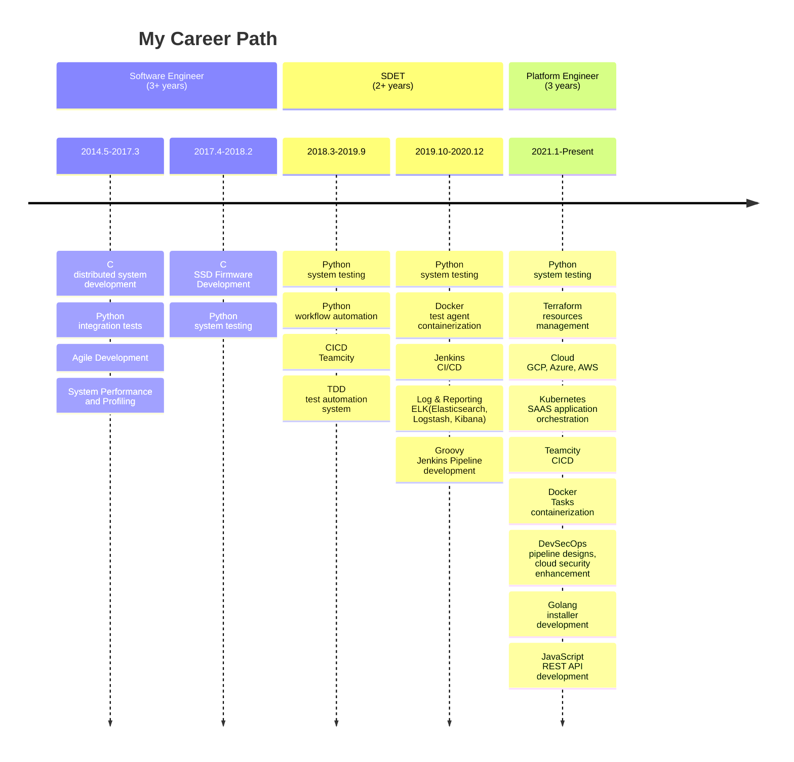

# About Me

  

    
  

  
  

    
    
  

## My Career Journey

Welcome!👋! I've marked down my career journey as a software engineer,
inspired by the idea of [The Ph.D. Grind: A Ph.D. Student Memoir](https://www.goodreads.com/en/book/show/15731248-the-ph-d-grind)

The software engineer journey is a pursuit of
[craftsmanship](https://manifesto.softwarecraftsmanship.org/) spirit.
Software engineers normally read more, grind more technologies and then use less and elegant code in work.

Computer programming is ultimately an form of art, that was the great insight from [Donald Knuth](https://en.wikipedia.org/wiki/Donald_Knuth), who even wrote a book to emphasize this point:
[The Art of Computer Programming](https://en.wikipedia.org/wiki/The_Art_of_Computer_Programming).

### Current status

- 🔭 I'm working with

  - [Python](https://www.python.org/)
  - [Golang](https://golang.org/)
  - [JavaScript](https://developer.mozilla.org/en-US/docs/Web/JavaScript)
  - [jenkins CI/CD](https://www.jenkins.io/doc/book/pipeline/),
  - [Teamcity](https://www.jetbrains.com/help/teamcity/teamcity-documentation.html)
  - [Terraform](https://www.terraform.io/)
  - [Kubernetes](https://kubernetes.io/)
  - [Docker](https://www.docker.com/)

- 🎵️🎶️ I'm playing with backend, micro-service, system design, DevOps, CI/CD, Teamcity, data visualization.

- 🌱🌳️ I'm learning history, psychology, philosophy, management.

- 🍻️🥂️ I'm looking to collaborate on more interesting open source projects.

- 💬🗒️ Ask me about test automation, philosophy, python.

- ☯️❤️ Fun fact: Life is the most precious journey, only once in the universe, enjoy it everyday.

<h3>
  Enjoy cultures across 🀄️🌏️🍁️🗽️🌎️ as a human, love the following
  technologies as a geek.{" "}
</h3>

<h2 align="center">❤️</h2>
<h2 align="center">
  
  
  
  
  
  
</h2>

<h2 align="center">
  
  
  
  
  
  
  
</h2>

<h2 align="center">
  
  
  
  
  
</h2>

  

---

## Quick Navigation

- 📚 **[Docs](/docs)** - Technical guides, notes, and learning resources
- 📝 **[Blog](/blog)** - Articles and technical posts
