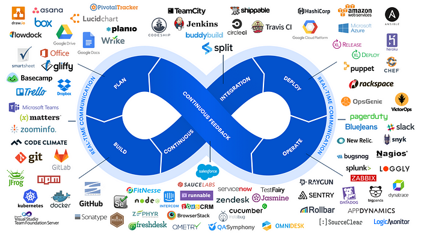
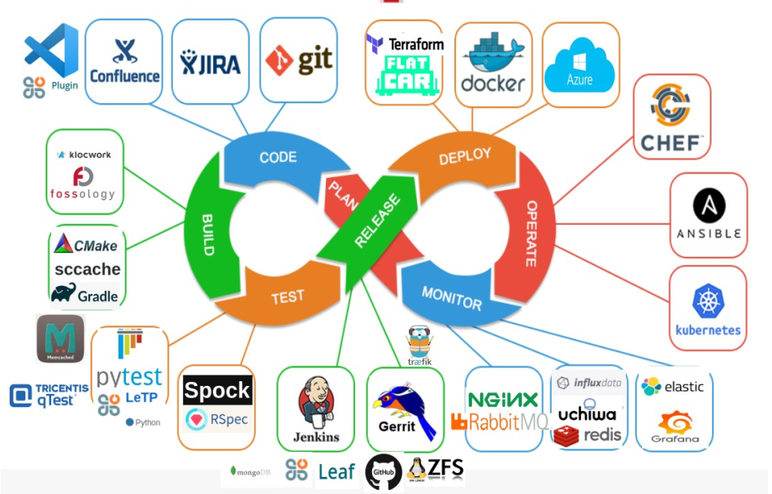
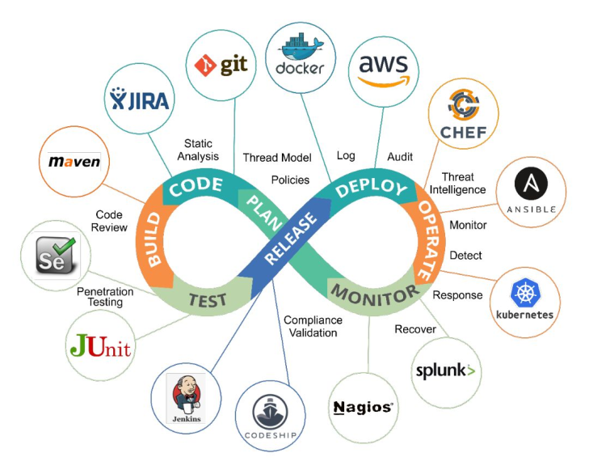

# DevSecOps Roadmap

## DevOps Tools of the Trade

## DevOps RoadMap

## DevSecOps RoadMap

## [DevSecOps Maturity Model(DSOMM)](https://dsomm.timo-pagel.de/)

## Why DevSecOps
>
> DevSecOps term is a relatively new term but given the rise in security awareness as well as breaches, it has become the talk of the town. Instead of having a team for manual security testing, it is way more efficient and cost/time effective to have automated security checks and catching the issue as soon as possible. This makes DevSecOps a highly demanded and regarded skill in the industry.

[DevSecOps](https://www.sumologic.com/insight/devsecops-rugged-devops/)

[Automating Terraform Deployment to Google Cloud with GitHub Actions](https://medium.com/interleap/automating-terraform-deployment-to-google-cloud-with-github-actions-17516c4fb2e5)

## Cloud technologies

* [12 Factor App](https://12factor.net/)
* [Azure Well Architected Framework](https://learn.microsoft.com/en-us/azure/architecture/framework/)
* SRE Practices
* [Cloud Design Patterns](https://learn.microsoft.com/en-us/azure/architecture/patterns/)

## Agile Manifesto

Manifesto for Software Craftsmanship

[Minifesto](http://minifesto.org/)

[Manifesto for Software Craftsmanship](https://manifesto.softwarecraftsmanship.org/)

## Reference

[DevOps-Roadmap-Github](https://github.com/raycad/devops-roadmap)
[DevSecOps-RoadMap-Github](https://github.com/hahwul/DevSecOps)
