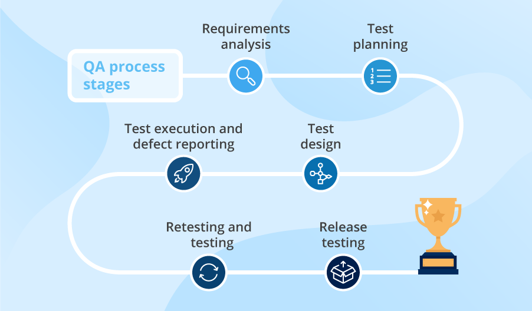

## Requirements analysis

QA professionals are involved in the analysis and clarification of functional
and non-functional software requirements and make sure the requirements are
clear, consistent, complete, traceable, and testable

## Test planning

[Test plan ISO/IEC/IEEE 29119-3:2013](https://www.iso.org/standard/56737.html)
A test plan should contain a test strategy and cover a testing scope, a project
budget and deadlines, the types and levels of testing an application requires,
bug tracking and reporting procedures, resources and their responsibilities,
and other factors.

## Test design

QA specialists design test cases or checklists covering software requirements.
Test cases outline conditions, test data (prepared at the test design stage as
well), and test steps needed to validate particular functionality, and
state an expected test result.

## Test execution and defect reporting

## Retesting and regression testing

## Release testing

Smoke testing

## References

[A Practical Guide to the Software QA Process](https://www.scnsoft.com/blog/qa-process)

[QA process maturity: Models and capabilities](https://www.scnsoft.com/blog/qa-process-maturity-models-and-capabilities)

