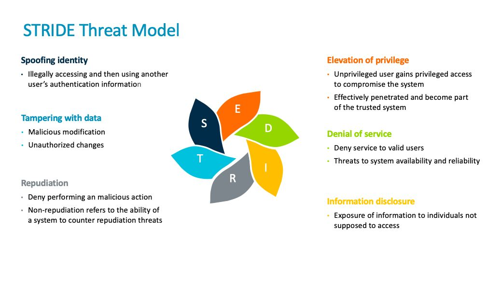

## Threat Model

[Threats](https://cybermap.kaspersky.com/)

## Tools

[Threatspec](https://github.com/threatspec/threatspec)

## References

[Threat Modeling](https://wildcardcorp.com/security/threat-modeling)

[Threat Modeling: 12 Available Methods](https://insights.sei.cmu.edu/blog/threat-modeling-12-available-methods/)

[Advanced threat modeling](https://owasp.org/www-pdf-archive/AdvancedThreatModeling.pdf)

[Threat modeling of connected cars using STRIDE](https://alissaknight.medium.com/threat-modeling-of-connected-cars-using-stride-e8184764eb0a)

[Threat modeling for web apps](https://www.netsparker.com/blog/web-security/threat-modeling/)

[Five steps to successful threat modeling](https://semiengineering.com/five-steps-to-successful-threat-modeling/)
