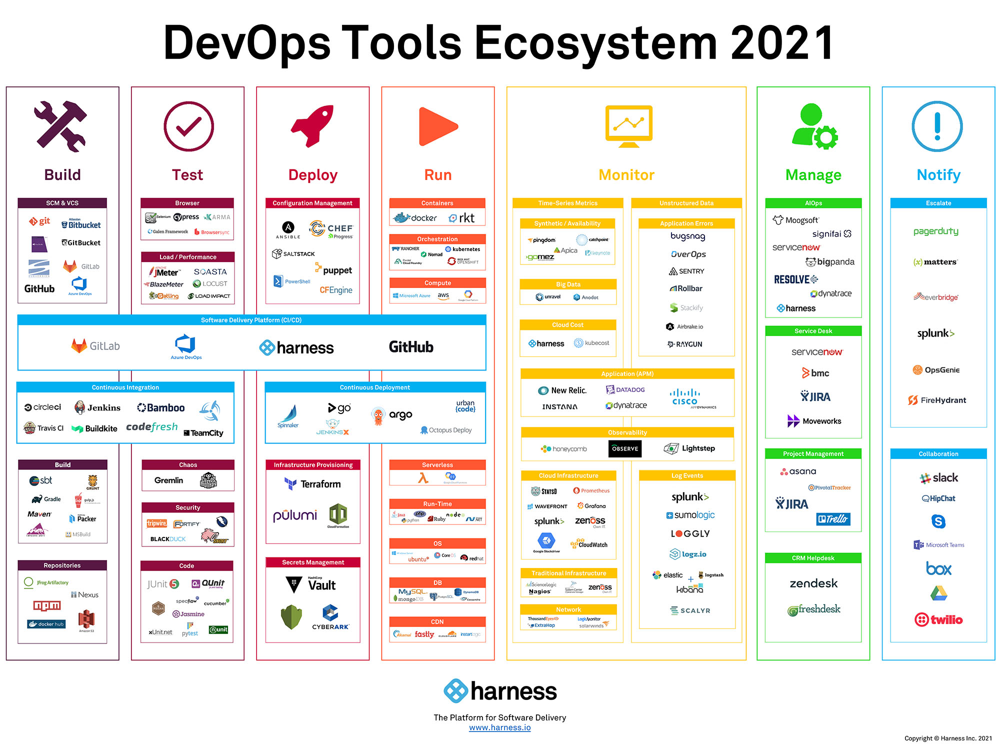

# Tools

## DevOps Tools Ecosystem 2021

Reference:

[UNDERSTAND DEVOPS ECOSYSTEM TO APPLY TRENDING PATTERNS](https://vedcraft.com/tech-trends/tech-tips/understand-devops-ecosystem-to-apply-trending-patterns/)

[Project to Product: A Cambrian Explosion of DevOps Tools](https://blog.planview.com/de/a-cambrian-explosion-of-devops-tools/)

## Remote debugger

- [theiaide](https://github.com/theia-ide/theia-apps)
- [VS Code Server](https://github.com/cdr/code-server)

## Monitor tool

Sensu
prometheus alertmanager
zabbix

Development environment management

[Terraform](https://www.terraform.io/) (GO) Infrastructure management -
primarily managing remote resources in cloud providers such as AWS.

[Vagrant](https://www.vagrantup.com/intro)
(Ruby) is a tool for building and managing virtual
machine environments in a single workflow.

[Vagrant vs. Terraform | Vagrant by HashiCorp](https://www.vagrantup.com/intro/vs/terraform)
