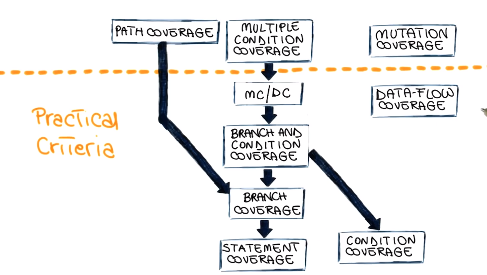

# Software Verification

## Verification approach

* Testing
* Static verification
* Inspection/Review
* Formal proofs of correctness (state machine)

### Testing Verifiation

Input Domain D -> Software -> Output Domain O
Individual test sets.

Pro: No False positive
Con: incomplete

### Verification

all possible inputs (executions) for Input Domain D.
Pro: Consider all program behaviors
Con: False positives

### Inspection(Reviews, walk-through)

Pro: systematic, thorough
Con: informal, subjective

### Formal proofs

Program implemented specifications.
Pro: strong guarantees.
Con: complex, expensive

## Testing

Executing a program on a **tiny** sample of the input domain.

* Dynamic technique
* Optimistic approximation

Successful tests

### Test granularity levels

* Unit tests: one module
* Integration testing: a subset of several modules
* System testing: the whole system.

### System testing

* Acceptance testing: validation against customer requirements.
* Regression testing

### Alpha and Beta testing

Users testing.

## Black-Box testing / Functional testing

* Based on specification.
* Covered as much specified behavior
* Cannot reveal errors due to implementation details.

Advantages:

* Focus on the domain
* No need for the coe, early test design
* Catches logic defects
* Applicable at all granularity levels

**A Systematic functional testing approach**:

1. Functional specification
2. Identify independently testable features
3. Relevant inputs
4. Test cases specification
5. Test cases

**How to select test cases in the test domain?**

* Random selection
* Partition of domains, e.g. x < 0, x = 0, x > 0
* Boundary values between domains.

### Category partition method

1. Identify independently testable features
2. Identify categories/characteristics
3. Partition categories into choices
4. Identify constraints among choices
    * Eliminate meaningless combinations
    * Reduce the number of test cases
    * Three types: property...if, error, single.
5. Produce/evaluate test case specifications
6. Generate test cases from test case specifications

### Model based testing

* Finite state machine
* Decision tables
* flow graphs
* historical models

## White-Box testing - Structured testing

* Based on the code.
* Cover as much coded behavior as possible.
* Cannot reveal errors due to missing paths.

Basic assumption
Executing the faulty statement is a necessary condition
for a fault.

### Advantage

* Based on the code.
* Can be used to compare test suites
* Allows for covering the coded behavior.

### Categories

* Control-flow based
* data-flow based
* fault based

### Coverage Criteria

Defined in terms of **test requirements from the code.**

Result in **test specifications, test cases.**

### Statement Coverage

Most used in the industry 80-90%

Number of executed Statements / total number of Statements.

### Control flow graphs

### Branch coverage

Number of executed branches / total number of branches

### Condition coverage

Test requirements: individual conditions in the program
Coverage measure:
number of conditions that are both T and F /
Total number of conditions.

### Branch & Coverage(B&C) coverage

Branches and individual conditions

### Modified condition/Decision coverage

Key idea: test important combinations of conditions and limited testing costs.

The FAA(Federal Aviation Administration) requires all software tested for MC|DC.

extend branch and condition coverage with the requirement that
**each condition should affect the decision outcome independently.**

### Other criteria

* Path coverage
* Data flow coverage
* Mutation coverage

