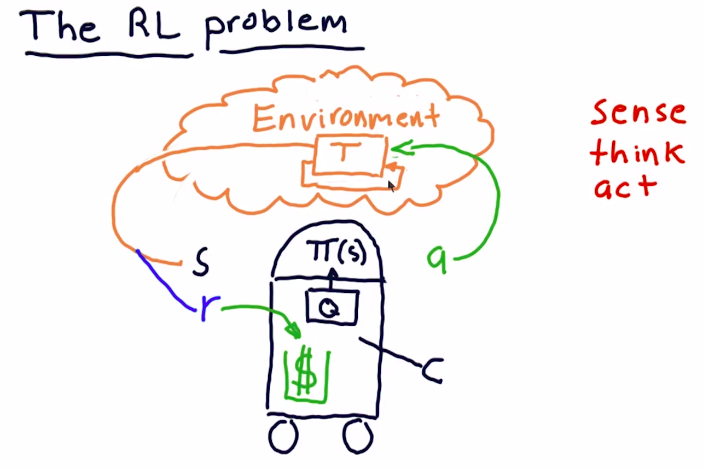

## Definition

A problem:
**The goal** is to choose an action in response to each data point.

Robot: Sense Think Act cycle.

## What's the process?

### Environment

Action -> Transition function -> State of Env

### Agent/Robot

State -> Policy: $\Pi(s)$ -> Collect Rewards, Action

### The goal

How to find $\Pi$ to maximize ?

#### Trading Analog

* Environment = Market
* Action = Buy/Sell
* State = Factors of stocks, e.g. P/E, Rollinger Band Value, etc.
* Rewards = money returns
* Policy: $\Pi$ = Trading strategy
  
## Algorithm type

### Model-Based

Use the transition T or the rewards R in the model.

### Model Free

It does not know or use the models of the transitions T or the rewards R.

## Fundamental Iterative methods

* Value iteration
* Policy iteration

[How To Code The Value Iteration Algorithm For Reinforcement Learning](https://towardsdatascience.com/how-to-code-the-value-iteration-algorithm-for-reinforcement-learning-8fb806e117d1)
[Fundamental Iterative Methods of Reinforcement Learning](https://towardsdatascience.com/fundamental-iterative-methods-of-reinforcement-learning-df8ff078652a)

## Reference

[Reinforcement Learning: A Survey](https://www.cs.cmu.edu/afs/cs/project/jair/pub/volume4/kaelbling96a-html/rl-survey.html)

Or [Reinforcement Learning: A Survey-PDF](https://arxiv.org/pdf/cs/9605103.pdf)

[Section 8.2 - Reinforcement Learning: An Introduction](http://incompleteideas.net/sutton/book/RLbook2018.pdf)

[Section 9 - Reinforcement Learning: An Introduction PPT](https://people.cs.umass.edu/~barto/courses/cs687/Chapter%209.pdf)
