# Neural Networks algorithms

Cell body -> Nevron -> Axon -> Synapses.

Perceptron

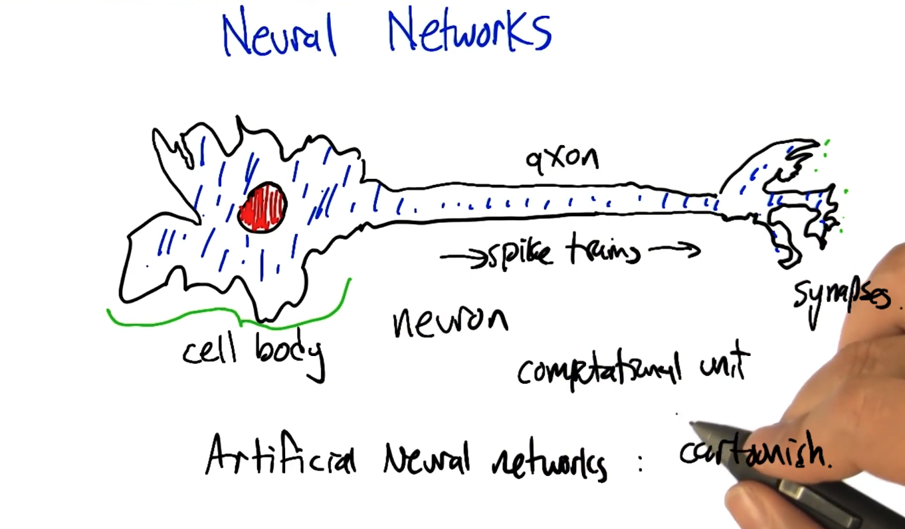

## Artificial Neural Networks

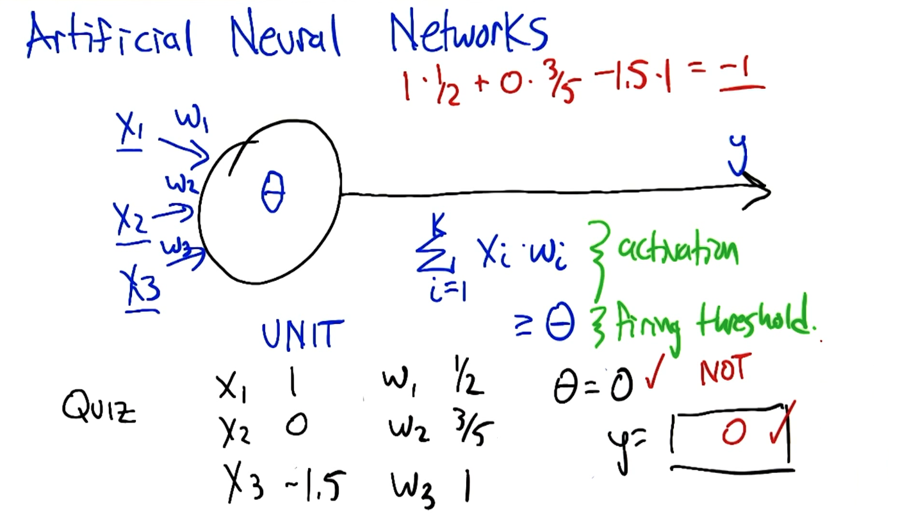

We need to pay attention to

* Activation function
* firing threshold

### How powerful is perceptron unit?

One activation function computes the half plane.

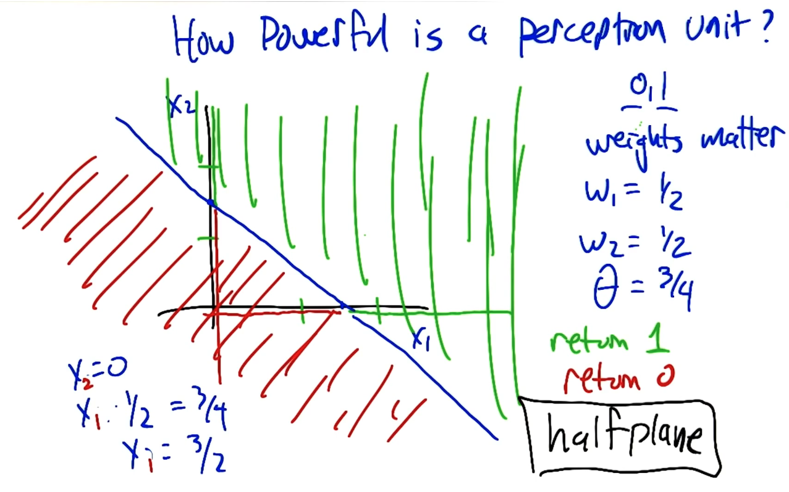

What's the nice and short computing in the following?

### Boolean: AND

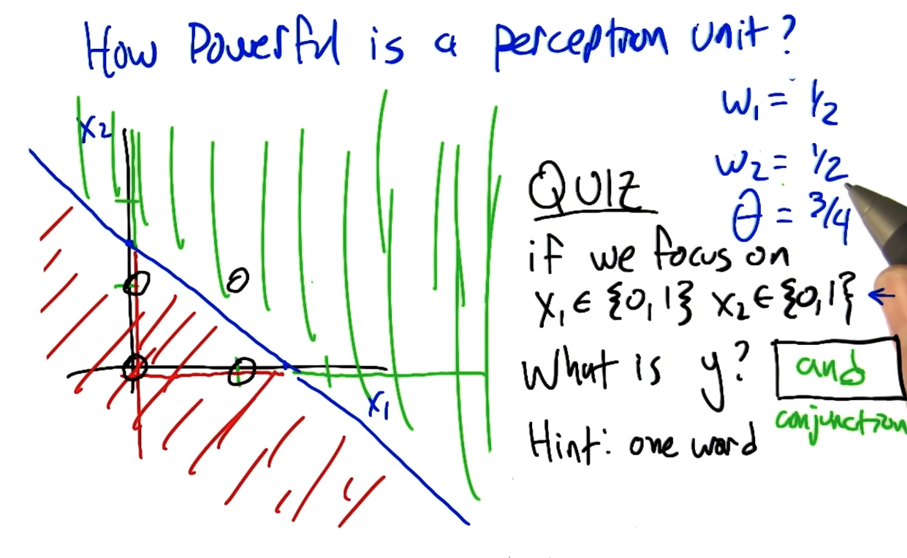

### Boolean: OR

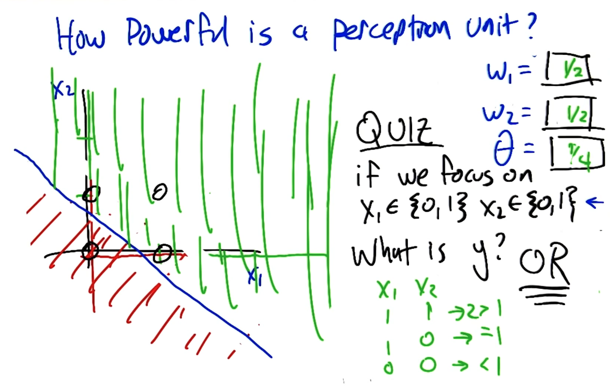

### Boolean: Not

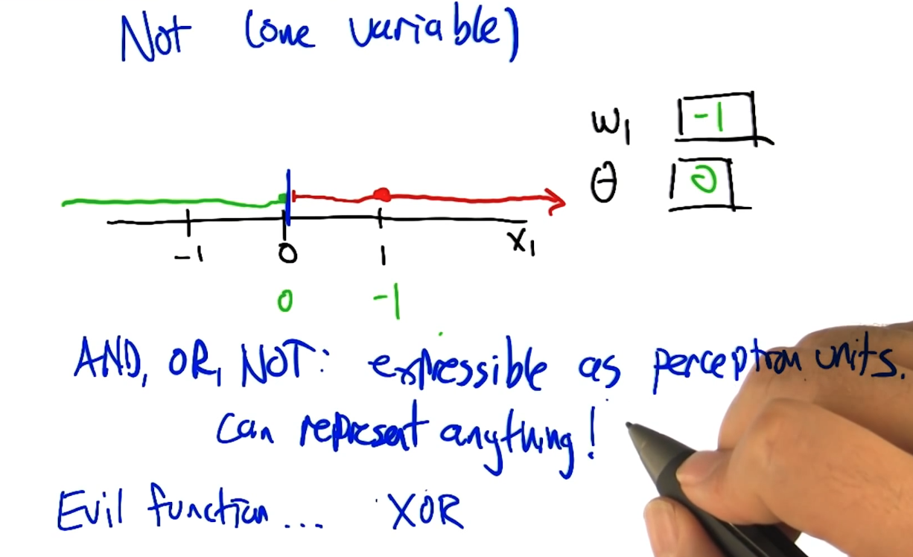

### XOR as Perceptron Network

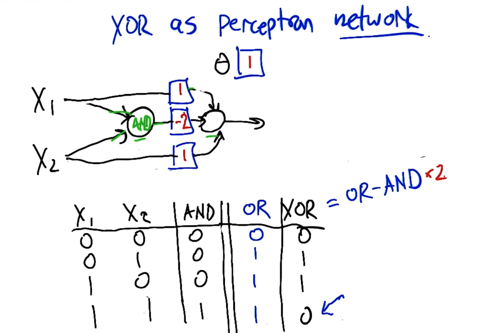

## Perceptron Training

Given examples, find weights that map inputs to outputs.

* Perceptron rule (**threshold**)
* Gradient descent / delta rule (**un-thresholded**)

### Perceptron rules

Single Unit

The halting problem for iterations.

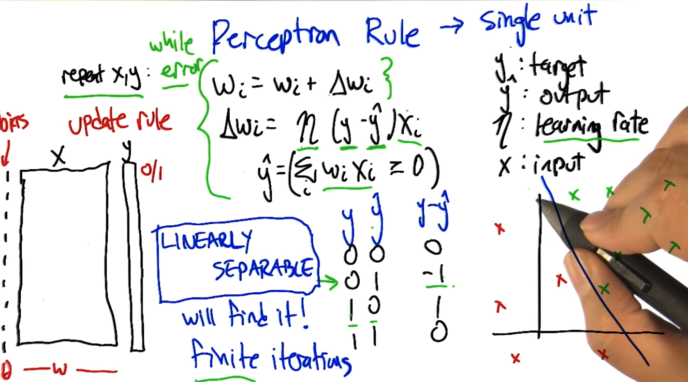

## Gradient Descent

Avoid Non-linear separability issues.

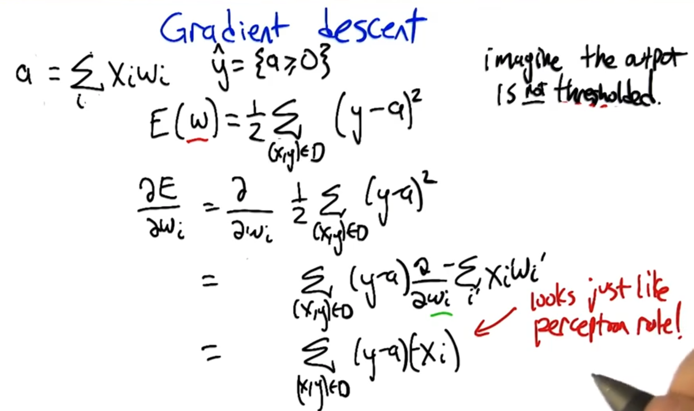

### Comparison of Learning rules

#### Perceptron rule

guarantee to finite convergence only if linear separability
$$
\Delta W_i = \eta (y - y') x_i
$$
Eta = learning-rate

y = target

y' = output

#### Gradient Descent rule

Calculus, robust, converge to local optimum

$$
\Delta W_i = \eta (y - a) x_i
$$

#### Comparing rules

## Sigmoid - differentiable threshold

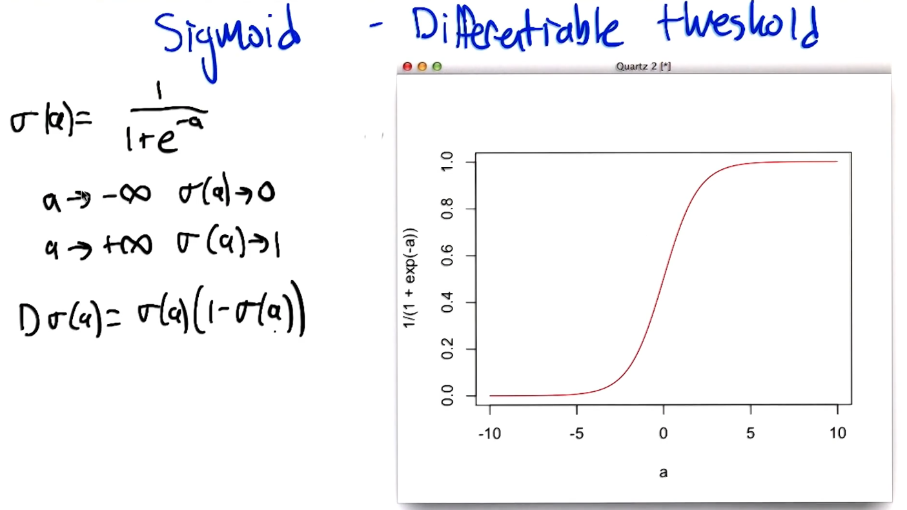

## Neural Network Sketch

Whole thing is differentiable!

Back-propagation -> computationally beneficial organization of the chain rule.

**The errors flowing backwards, sometimes it's even called error back propagation.**

Many local optimal!!!

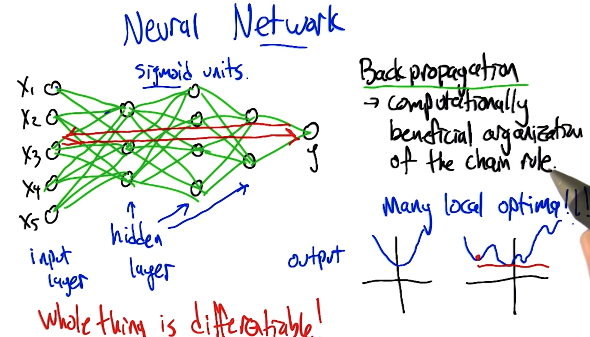

## Optimizing weights

* Gradient descent
* Advanced methods
  * Momentary
  * Higher order derivatives
  * Randomized optimization
  * Penalty for "complexity"

Optimization:: learning

* More nodes
* More layers
* Large numbers

## Restriction Bias

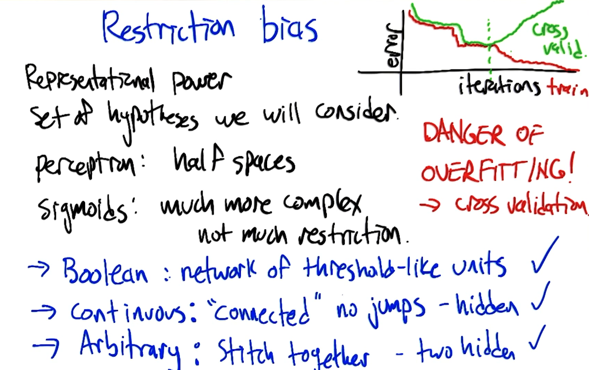

## Peference Bias

Algorithm's selection of one representation over another.

What algorithm?

Gradient descent. We need to check initial weights. Normally, we pick up small random values. Local minimal variability

Low "complexity", simpler explanations.

### Occam's razor

Entities should not be multiplied unnecessarily.

## Summary

* Perceptrons - threshold unit
* Networks can produce any boolean functions.
* Perception rule - finite time for linearly separable
* General differentiable rule - back propagation & gradient descent
* Preference & restriction bias of neural networks.
