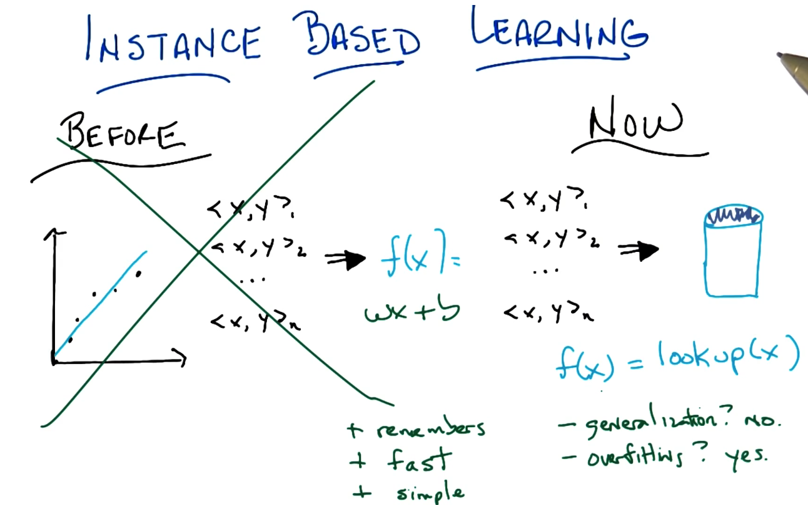
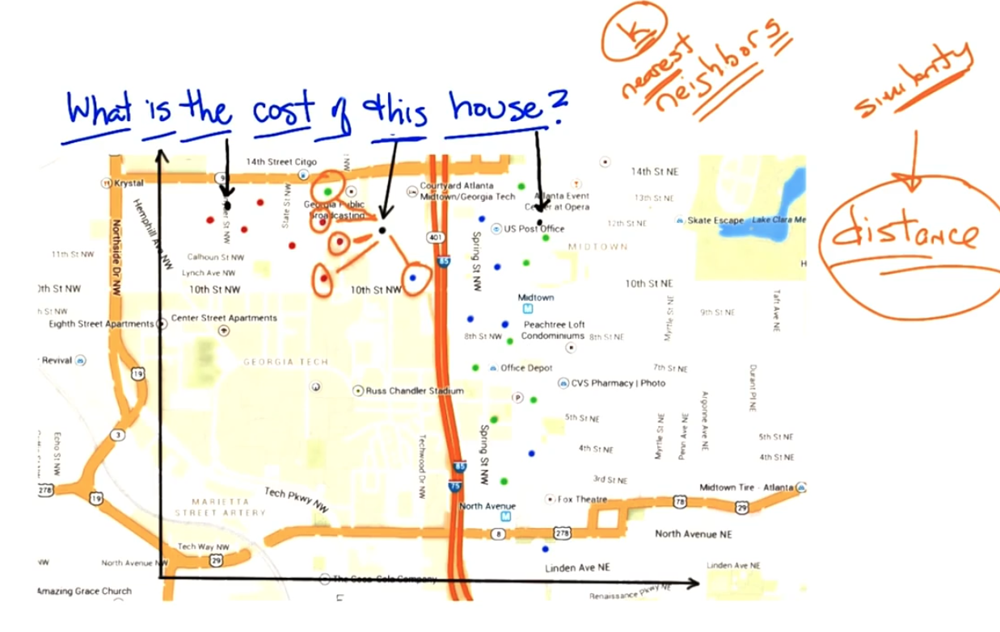
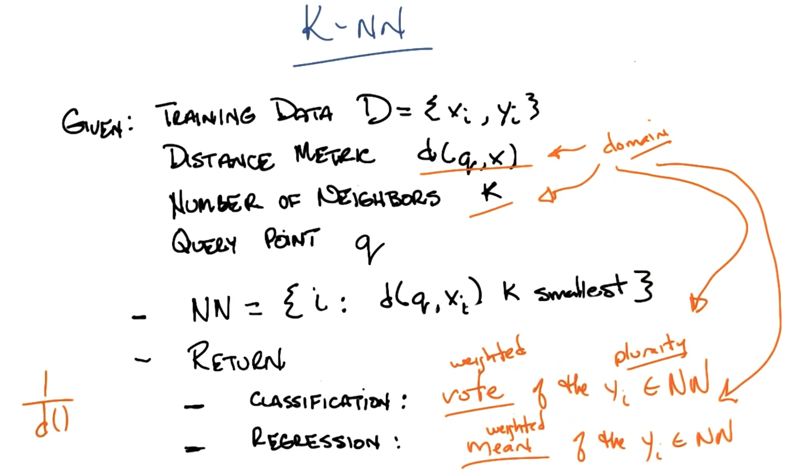

# Instance Based Learning, KNN

## Introduction

### Pros

* Remember

* Fast
* Simple

### Cons

* No generalization
* Overfitting
* Can't handle multiple reference to the same value/ weights.

## Cost of the house

## KNN

## KNN Bias

Preference Bias: Our believe about what makes a good hypothesis

* Locality -> near points are similar

* Smoothness -> averaging

* An features matter equally ( distances are the same for different dimensions)

## Won't you compute my neighbors?

## Curse of Dimensionality

As the number of features or dimensions grows, the amount of data we need to generalize accuracy grows exponentially.

## Some other stuff

* Distance(x,q) , Euclian, Manhattan (weighted) - regressions, mismatches for "colors"
  * Define a function to measure similar functionality between different points.
  * The idea of similarity measurement.
* K : how to pick K. K = n. Weighted average n.
  * **Locally weighted regression**
  * **Locally weighted linear regression**

## What have we learned

* Instance based learning
* Lazy vs. eager learning.
* KNN.
* Nearest neighbor: similarity function (distance)
  * **Domain knowledge matters.**
* Classification vs regression
* Averaging.
* Locally weighted $X regression.

### No free lunch

Any learning algorithm that you create, if you average over all possible instances, it's doing similar to random.

#### Solution

Use the domain knowledge to pick up the best similarity functions.

## Motivation of this class

Let students learn the domain knowledge and pick up the right approach for the learning task.
