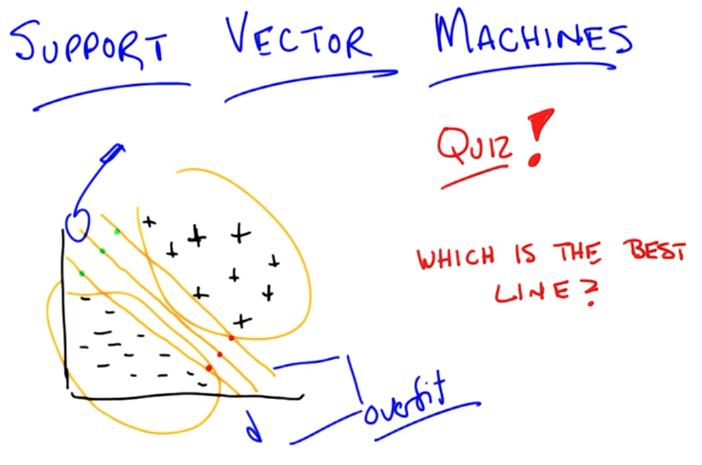
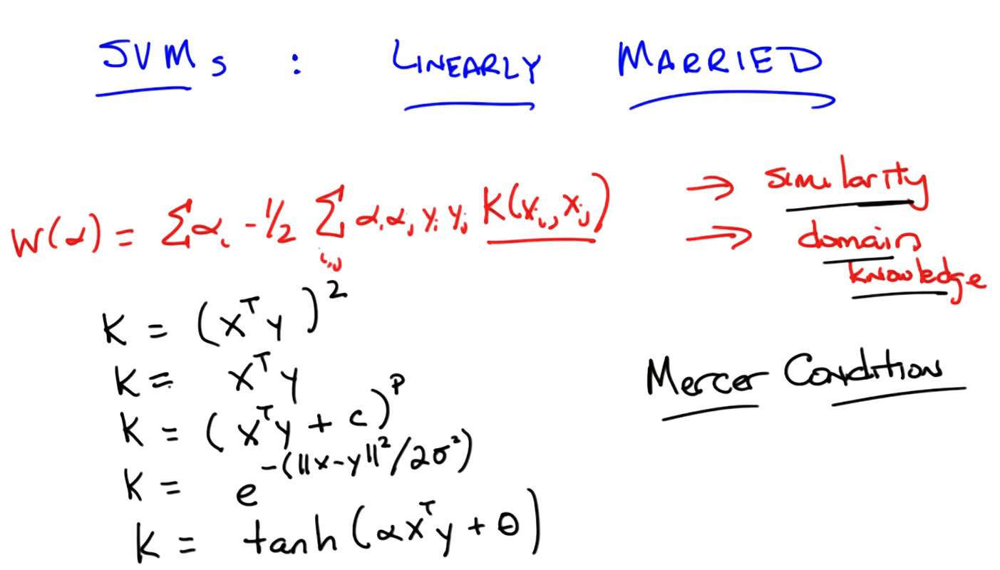

# Kernel Methods & SVMs

Support Vector Machines (SVM)

We can't believe our training data too much.

* That's why to pick up the middle line.

* Other lines seem to be over fitting.

## Optimal separator

Another way of instance of learning, not completely lazy, figuring out which part you could actually stand to throw away.

## What's the output?

Using kernel trick.

How do we use function to define similarity? Using kernel function to transform.

## Kernel

The function needs to meet Mercer Condition that it acts as a distance or similarity.

## Summary

* Margins -> generalization & overfitting
* Bigger margin is better
* Optimization problem of finding max margins: Quadra program
* Support vectors
* Project data into higher dimensional spaces.
* Kernel check via domain knowledge.

## Boosting

## Boosting Summary

* Margins to generalization & overfitting

* Big is better

* Optimization problem for finding max margins: QPs

* Support vectors

* Kernel trick
  $$
  X^TY = K(X,y)
  $$
  Domain knowledge.
