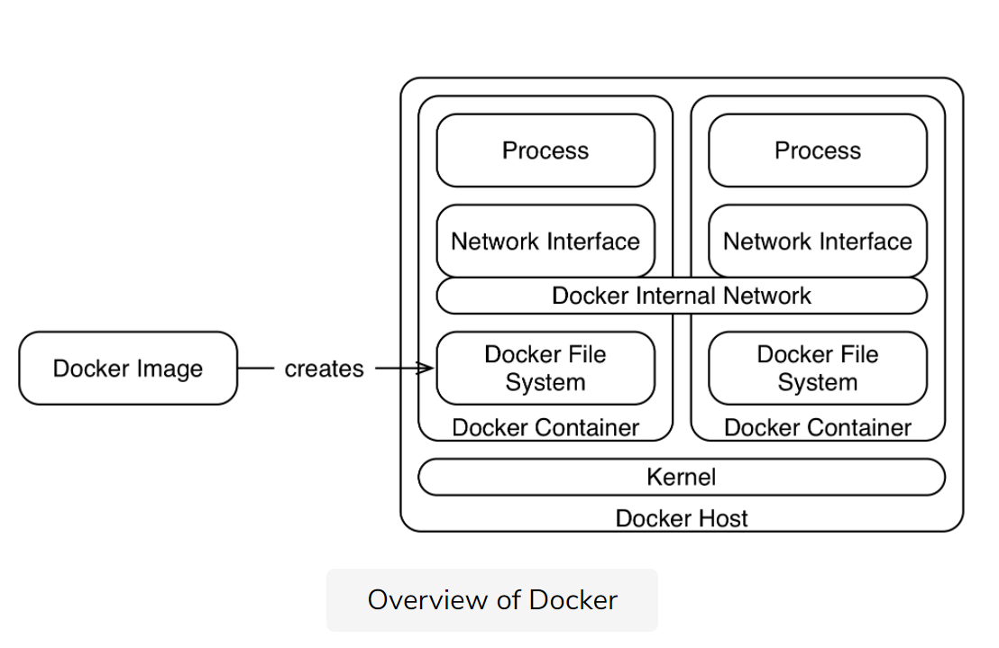

# Docker

[Moby](https://github.com/moby/moby)

The [Open Container Initiative](https://www.opencontainers.org/) ensures via
standardization of the compatibility of the different container systems.

## Basics

### Features

* Shared kernel
* Isolated network
* Optimized file system
* One process per container.

### Repository

 [Nexus](https://www.sonatype.com/nexus-repository-sonatype) and
 [Artifactory](https://www.jfrog.com/open-source/#artifactory)

## Immutable server with Docker

## Docker and tools: Puppet, Chef or Ansible

**Idempotent installation** means that an installation script provides the same
results no matter how often it runs.

## Docker Compose

In a Docker Compose environment, **a service can simply contact another service
via a Docker Compose link** and then use the service name as the hostname.

 Docker Compose links also implement **load balancing** and

set the start order so that the dependent Docker containers start first.

[reference documentation](https://docs.docker.com/compose/reference/overview/)

## Variations

* **Virtualization** has too much overhead.
* **Processes** are not sufficiently isolated.
* Other **container solutions** such as [rkt](https://coreos.com/rkt) are far less common.

### Clusters

* [Docker Swarm Mode](https://docs.docker.com/engine/swarm/)
* **Kubernetes**
* [**Mesos**](http://mesos.apache.org/) is actually a system for managing batches
* for data analysis in a cluster but it also supports Docker containers.

### *how* the load is distributed in the cluster is decided by the scheduler?

Docker containers are used for deployment, keep production and test env identical
as Immutable servers.

Traditional virtualization is still responsible for high availability, scaling,
and distribution to the servers.

That is, by Kubernetes or Docker Swarm Mode.

* Fail-safety
* Load balancing
