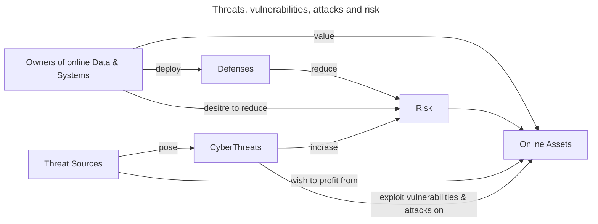

# P1L1 The Security Mindset

## Definition

Project something valuable from criminal activities.

## Threat source

* **Cyber-criminals**: want to profit from others' sensitive data.
* **Hacktivists**: don't like something you do or something you are.
* **Nation-Sates**: political advantage or for espionage.

## Vulnerabilities and attacks

* Threat actors exploit vulnerabilities to launch attacks.
* Attacks lead to compromise or security breaches
* Vulnerabilities in software, networks and humans.

## Real world attacks

2013 Target store breach.

[Sony Pictures hack](https://en.wikipedia.org/wiki/Sony_Pictures_hack)

### Relationship of Key Cyber Security Concepts

### Data requirements (CIA)

* Confidentiality
* Integrity: should not be modified, change or corrupted.
* Availability

## How to protect?

* Prevention
* Detection
* Response
* Recovery and remediation
* Policy (**What**) vs. mechanism(**how**)

world-wide $500 Billion annual loss

### Example Stuxnet

[Stuxnet: How It Infects PLCs (Links to an external site.)](https://www.youtube.com/watch?v=XgOcYC9xGT8)

[The Real Story of Stuxnet (Links to an external site.)](http://spectrum.ieee.org/telecom/security/the-real-story-of-stuxnet)

[Kobayashi Maru](http://www.rumint.org/gregconti/publications/KobayashiMaru_PrePub.pdf)

## Summary

### Cyber Security

* Huge problem for people, governments, companies, etc.
* Enhance the level of assurance of systems

The security mindset requires we know:

* **Threats**
* **actors**/motivations
* How they successfully **attack**.
