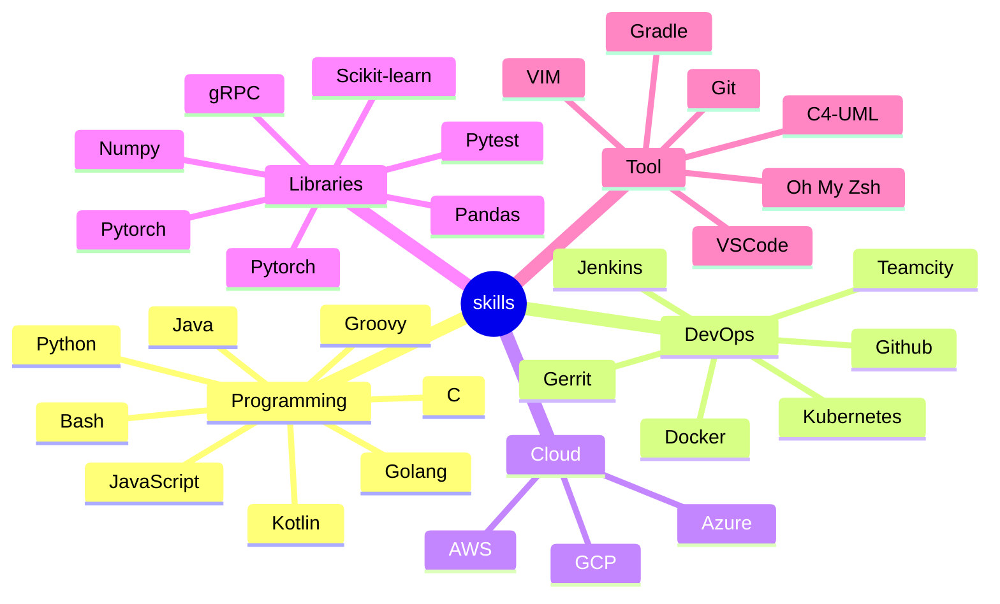

# Introduction

Welcome to my home on the internet!!! Here are my notes about Techs/Computer Sciences.

I've marked down my grinding journey as a software developer,
inspired by the idea of [The Ph.D. Grind: A Ph.D. Student Memoir](https://www.goodreads.com/en/book/show/15731248-the-ph-d-grind)

Software engineers normally read more, grind more technologies and then use less and elegant code in work.

The software engineer journey is a pursuit of
[craftsmanship](https://manifesto.softwarecraftsmanship.org/) spirit.

Happy coding! Happy life!

## My skill sets

